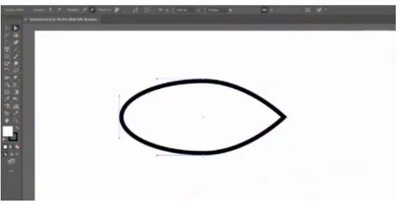
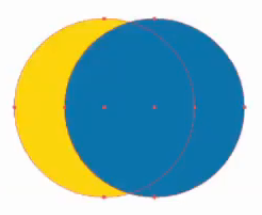

## Adob​​e 人工智慧

#### Q1。 如果將下面所示的物件的填滿色彩複製並貼上到文件色彩模式設定為 CMYK 的另一個 Illustrator 檔案中，會發生什麼情況？

- [x] 填滿色彩將轉換為 CMYK 值
- [ ] 填滿色彩將保持不變。
- [ ] Illustrator 將顯示錯誤，因為您無法將具有 RGB 顏色的物件貼到 CMYK 檔案中。
- [ ] 填滿色彩將保持 RGB，但其外觀會改變。

#### Q2。 您想要使用散點畫筆向下圖中的圓形背景物件添加一些星星。 如何確保星星只出現在圓圈內？

- [ ] 在刷之前選擇螢幕混合模式。
- [x] 選擇圓圈並在刷之前點擊工具列上的「在內部繪製」按鈕。
- [ ] 在散佈畫筆選項中新增固定間距值。
- [ ] 選擇畫筆描邊和圓圈並建立複合路徑。

#### Q3。 為什麼要使用「儲存選擇」指令？

- [ ] 保留您計劃光柵化的物件的向量副本
- [ ] 將選定物件的副本儲存在新檔案中
- [x] 保留您可以再次使用的物件選擇
- [ ] 將選定的物件保存在 Creative Cloud 庫中

#### Q4。 當您使用鋼筆工具主動繪圖時，哪個操作會閉合路徑？

- [x] 點選或拖曳路徑中的第一個點
- [ ] 選擇“物件”>“路徑”>“連接”
- [ ] 按 Return (Mac) 或 Enter (Windows)
- [ ] 切換到不同的工具

#### Q5。 使用哪種效果來增強下面加州輪廓的深度？

加州的地圖具有淺米色主色和小深色陰影。

- [x] 3D 拉伸和斜角
- [ ] 偏移路徑
- [ ] 3D 旋轉
- [ ] 3D 旋轉

#### Q6。 當選擇了多個物件時，如何僅取消選擇其中一個？

- [ ] 按住 Option (Mac) 或 Alt (Windows) 鍵並點選要取消選取的物件。
- [ ] 使用套索工具取消選擇不需要的物件。
- [ ] 按住 Shift 鍵並點選要取消選取的對象
- [x] 按 Command+Shift+A (Mac) 或 Ctrl+Shift+A (Windows)，然後按一下要取消選取的物件。

#### Q7。 您需要更改下面地圖中所有資訊圓圈的填滿顏色。 這些圓圈不是由符號創建的。 除了全域編輯之外，哪個命令可以幫助您有效率地完成此任務？

南加州地圖包含許多淺藍色陰影的資訊圓圈。

- [ ] 重新著色圖稿
- [ ] 選擇 > 相同 > 外觀
- [ ] 編輯顏色
- [x] 即時繪畫

#### Q8。 如何反轉下圖中螺旋上所有箭頭的方向？

一條紅線順時針螺旋向中心。 沿線的箭頭指向該方向。

- [x] 選擇「物件」>「路徑」>「反轉路徑方向」。
- [ ] 選擇效果 > 3D > 旋轉。
- [ ] 使用「變換」面板選單中的「水平翻轉」和「垂直翻轉」指令。
- [ ] 使用重塑工具拖曳路徑。

#### Q9。 您將如何處理左側錨點以使物件對稱？

- [ ] 去掉它。
- [ ] 在錨點處剪下路徑。
- [x] 將其轉換為角點。
- [ ] 將其轉換為平滑點。

#### Q10。 什麼時候使用刀工具？

- [ ] 當您想要在現有錨點處剪下物件時
- [x] 當你想要將一個物體切成相等的碎片時
- [ ] 當您想要裁切嵌入或連結的圖片時
- [ ] 當您想要透過繪製封閉的徒手路徑快速分割物件時

#### Q11。 您有一個全彩 RGB 文檔，並且需要建立一個僅在黑色印版上列印的灰階版本。 你怎樣才能做到這一點？

- [x] 選擇文件中的所有內容，然後套用「轉換為灰階」指令。
- [ ] 應用轉換為灰階指令並將文件色彩模式變更為 CMYK。
- [ ] 使用「重新著色圖稿」指令並選擇「1 色作業」預設。
- [ ] 從樣本面板中刪除除黑色和白色之外的所有顏色樣本。

#### Q12。 您一直在 Essentials 工作區中工作，並更改了面板的排列，關閉了一些預設開啟的面板，並從「視窗」選單中開啟了其他面板。 如何恢復面板的預設排列？

- [ ] 切換到任何其他工作區，然後切換回 Essentials。
- [ ] 退出 Illustrator，按住 Command+Shift+Option (Mac) 或 Ctrl+Shift+Alt (Windows)，然後重新啟動 Illustrator。
- [x] 從「工作區」選單或「工作區」切換器中選擇「重設 Essentials」。
- [ ] 退出並重新啟動 Illustrator。

#### Q13。 您的老闆喜歡您設計的新徽標gned，但希望看到使用不同配色方案的一些變化。 您可以使用哪個功能來快速產生這些變體？

- [ ] 變數
- [ ] 重新著色圖稿
- [x] 即時繪畫
- [ ] 校樣顏色

#### Q14。 確保下圖中顯示的所有物件都精確地相鄰放置且之間沒有空間的最快且最有效的方法是什麼？

- [x] 指定一個關鍵對象，然後使用「對齊」面板中的「水平分佈空間」指令，間距值為 0
- [ ] 打開智慧參考線並拖曳每個對象，直到它與旁邊的對象對齊。
- [ ] 選擇「移動」指令，然後在對話方塊中將「距離」值設為 0。
- [ ] 使用選取工具選擇對象，然後從選取邊界框的一側拖曳，直到物件對齊在一起。

#### Q15。 您在顏色選擇器中選擇一種新顏色，並希望看到不同色調和色調的多種變化。 哪個功能允許您執行此操作？

- [ ] Adob​​e 顏色主題
- [ ] 色彩指南
- [ ] 顏色組
- [x] 重新著色圖稿

#### Q16。 「讓像素完美」指令的用途是什麼？

- [x] 建立響應式網頁圖形，可以在不損失品質的情況下調整大小
- [ ] 確保圖形僅使用網路安全顏色
- [ ] 讓 Illustrator 根據圖形內容自動選擇正確的匯出檔案格式
- [ ] 創建清晰的網頁圖形，無需直線抗鋸齒

#### Q17。 您的畫板上只有一個物件。 您想要將其填充顏色從黑色更改為黃色，因此您打開顏色選擇器並選擇黃色。 但是，當您按一下「確定」時，物件的填滿會變成灰色，而不是黃色。 為什麼會發生這種情況？

- [ ] 填滿的顏色模式設定為灰階。
- [ ] 亮度混合模式應用於填充。
- [ ] 在「檢視」功能表的「校樣設定」下選擇「色盲」選項之一。
- [x] 疊印預覽在分色預覽面板中開啟。

#### Q18。 如何確保您正在處理的文件中的專有名詞沒有連字號？

- [x] 關閉「段落」面板中的「連字符大寫單字」。
- [ ] 在段落面板中選擇對齊所有行。
- [ ] 減少對齊選項中的字間距。
- [ ] 增加「段落」面板中的「斷字區」值，使其大於文字的磅值。

#### Q19。 如何快速將下圖中的所有六邊形變成三角形？

- [ ] 在「控制」面板中，按一下按鈕開始編輯相似形狀，然後選擇「物件」>「路徑」>「簡化」。
- [x] 在“屬性”面板中，按一下“開始全域編輯”，然後使用“變換”控制項將“多邊形邊數”減少到 3。
- [ ] 在「屬性」面板中，按一下「展開形狀」。 然後點擊“開始全域編輯”並使用“變換”控制項將“多邊形邊數”減少到 3。
- [ ] 在控制台中，按一下按鈕開始編輯類似的形狀，然後選擇「物件」>「變換」>「變換每個」。

#### Q20。 您正在使用數位板，並發現使用橢圓、矩形和多邊形工具建立物件有些尷尬。 哪種工具可以讓您透過直覺的手勢繪製、移動和編輯這些形狀？

- [ ] 平滑工具
- [ ] 形狀產生器工具
- [ ] 鉛筆工具
- [x] 塑造工具

#### Q21。 使用即時油漆桶工具以色彩填滿圖稿時，由於路徑之間的間隙大小，您無法填滿某些區域。 您可以在「間隙選項」對話方塊中執行什麼操作來解決此問題？

- [ ] 選擇小間隙。
- [x] 選擇「用路徑縮小間隙」。
- [ ] 選擇大間隙。
- [ ] 關閉間隙檢測。

#### Q22。 您經常使用圖案箭頭畫筆庫中的畫筆。 如何才能在啟動 Illustrator 時自動開啟該程式庫？

- [ ] 從畫筆面板選單中選擇顯示圖案畫筆。
- [ ] 從庫的面板選單中選擇持久。
- [x] 開啟庫並儲存自訂工作區。
- [ ] 選擇「圖案箭頭」畫筆庫中的所有畫筆，然後從庫的面板選單中選擇「新增至畫筆」。

#### Q23。 在下圖中，您嘗試使用「連接」工具刪除兩條路徑的重疊部分（以黃色突出顯示），但似乎沒有任何反應。 為什麼是這樣？

- [ ] 路徑沒有填滿屬性。
- [ ] 只選擇其中一個路徑，但兩者都需要選擇。
- [ ] 選擇了其中一個路徑，但「連接」工具僅適用於未選擇的路徑。
- [x] 需要在兩條路徑中選擇端點，然後才能修剪和連接它們。

#### Q24。 使用藝術畫筆、散點畫筆或圖案畫筆套用專色時，應選擇哪一種著色方法？

- [x] 無
- [ ] 色調
- [ ] 色調和色調
- [ ] 色調偏移

#### Q25。 你在設計中繪製了一個五角星並想要更改內半徑。 你將如何實現這個目標？

- [ ] 星形的內半徑無法修改，必須重新繪製。
- [ ] 按住 Option+Shift (Mac) 或 Alt+Shift (Windows) 的同時使用縮放工具。
- [x] 選擇內部點，然後使用縮放工具統一變更半徑。
- [ ] 雙擊星形工具並變更內半徑選項。

#### Q26。 下圖中雲圖示上的三個點是什麼意思？

- [ ] Alana 字體已停用。
- [x] Alana 字型僅供網頁使用。
- [ ] Alana 字體目前正在啟動。
- [ ] 並非 Alana 系列中的所有字體都已啟動。

#### Q27。 您將應用什麼指令來使所選圖稿下方的物件在圓圈內可見？

黃色矩形的中心有一個圓形選區。

- [ ] 製作圖案
- [ ] 創建即時繪畫組
- [ ] 製作複合路徑
- [x] 製作剪貼蒙版

#### Q28。 符號噴射器工具已用於將多個符號實例套用到插圖中。 您想要使用圖形樣式修改某些實例的外觀。 如何實現這項目標？

- [x] 使用「群組選擇」工具選擇實例，然後選擇所需的圖形樣式。
- [ ] 符號集中的符號實例不能被覆寫。
- [ ] 使用直接選擇工具選擇實例，然後選擇所需的圖形樣式。
- [ ] 使用符號樣式器工具，選擇圖形樣式並將該樣式繪製到符號實例上。

#### Q29。 使用鋼筆工具點擊現有錨點時會發生什麼？

- [ ] 刪除所有控製手柄，將該點轉換為角點。
- [ ] 路徑在該點被分割。
- [x] 該點已刪除。
- [ ] 該點被選擇。

[參考](http://www.photoshopforphotographers.com/3101-1901/Help_guide/tp/Pen_path_tools.html)

#### Q30。 建立網格物件時，什麼時候應該使用「網格」工具而不是「物件」選單中的「建立漸層網格」命令？

- [x] 當您想要建立更簡單的網格時，以免 Illustrator 的效能受到負面影響
- [ ] 當您想要在物件的邊緣放置高光時
- [ ] 當您想要在物件內以等間隔建立網格線時
- [ ] 當您想要在物件內的一個或多個特定位置建立網格線時

#### Q31。 當您在大綱模式下查看下面所示的藝術作品時，您能看出“背包”這個詞的什麼訊息嗎？

- [ ] 已轉換為輪廓。
- [ ] 這是即時文字。
- [ ] 複合路徑。
- [x] 它的填滿顏色為黑色。

#### Q32。 您希望圖表中的欄位覆蓋類別軸的整個長度。 你會選擇什麼選項？

- [x] 在「圖表類型」對話方塊中，選擇「類別軸」並將「刻度線」選項設為「全寬」。
- [ ] 在「圖形類型」對話方塊中的「圖形選項」下，將簇寬度設為 100。
- [ ] 在第一行資料中，在與類別列對應的每個儲存格中鍵入 100%。
- [ ] 使用直接選取工具選擇列，然後使用縮放工具修改寬度。

##### Q33。 如果您正在工具列中尋找某個工具，但它不可見，該怎麼辦？

- [ ] 未選擇任何內容，按一下「屬性」面板中的「更多工具」按鈕。
- [x] 點選工具列底部的省略號。
- [ ] 在首選項中開啟該工具。
- [ ] 在「視窗」功能表中，按一下「視窗」>「工具」。

#### Q34。 下圖中顯示的四朵花是透過將藝術畫筆應用於不同長度的路徑來創建的。 如何防止花 2、3 和 4 中出現的扭曲，同時保持所有花的葉子大小和莖的寬度相同？

- [ ] 開啟藝術畫筆選項對話方塊並選擇按比例縮放。
- [x] 展開扭曲花朵的外觀並使用選擇工具拖曳花朵。
- [ ] 使用鋼筆工具在莖的頂部和底部添加點，然後使用直接選擇工具拖曳點以消除扭曲。
- [ ] 開啟“藝術畫筆選項”對話框，選擇“在參考線之間拉伸”，然後放置參考線，以便只有筆桿位於它們之間。

#### Q35。 當列印具有多種色域外顏色的影像時，您會選擇哪種渲染意圖來最好地保留顏色之間的視覺關係（而不是特定的顏色值）？

- [ ] 絕對比色
- [ ] 感性
- [ ] 飽和度
- [x] 相對比色

#### Q36。 使用“人偶扭曲”工具時，為什麼要更改“展開網格”值？

- [ ] 它可以讓您工作得更快，因為修改更大的網格需要更少的計算。
- [ ] 它允許您一起修改脫節的對象
- [ ] 全部允許您對物件進行更大的修改。
- [x] 它可以讓你更清楚地看到網格。

#### Q37。 使用影像追蹤功能時，哪個選項對追蹤結果中建立的路徑數量影響最大？

- [ ] 角點
- [x] 噪音
- [ ] 路徑
- [ ] 顏色

#### Q38。 如果您想建立圖像映射，您會使用哪個面板將物件變成可單擊區域？

- [x] CSS 屬性
- [ ] 屬性
- [ ] 連結
- [ ] SVG 交互

#### Q39。 為什麼在將 Web 圖形匯出為 SVG 格式之前使用 Simplify 指令？

- [ ] 減少程式碼中必須表示的點數
- [ ] 刪除不可見的點和線
- [x] 降低輸出分辨率，使其適合網頁圖形
- [ ] 合併冗餘對象

#### Q40。 您已設計瞭如下所示的產品標籤。 您的客戶希望黑色圓圈列印得盡可能暗，並要求列印標籤時沒有任何彩色徽標元素透過圓圈顯示。 你該怎麼辦？

- [x] 選擇圓圈並在「屬性」面板中啟用疊印填滿。
- [ ] 選擇圓圈並套用「正片疊底」混合模式。
- [ ] 用由所有四種印刷油墨組成的豐富黑色填充圓圈。
- [ ] 使用「外觀」面板添加第二個黑色填充。

#### Q41。 您正在使用包含連結的 Photoshop 檔案的 Illustrator 檔案。 您的客戶發送了一份具有不同名稱的新 Photoshop 文件，並要求您替換 Illustrator 文件中的舊文件。 您將使用“連結”面板中的哪個命令來完成此操作？

- [ ] 放置選項
- [ ] 編輯原始內容
- [x] 更新鏈接
- [ ] 重新鏈接

#### Q42。 動態符號的多個實例的填滿顏色已被修改。 將每個實例中的填充顏色恢復為其原始外觀的最快方法是什麼？

- [ ] 將匯出類型設定為影片剪輯
- [ ] 刪除符號並展開所有實例
- [ ] 將符號轉換為靜態符號
- [x] 斷開符號的鏈接

#### Q43。 在下面所示的禮品卡中，需要用清漆印刷洋紅色花瓣。 您將如何設定文件，以便將清漆塗在花瓣的洋紅色上？

- [x] 使用文件資訊為您的列印服務提供者留下說明。
- [ ] 將花瓣複製到一個名為「清漆」的新圖層。
- [ ] 確保洋紅色來自專色樣本。
- [ ] 在原始圖稿上建立花瓣的副本，並使用設定為疊印的新專色樣本填充花瓣。

#### Q44。 您的客戶喜歡下面文字中的圖案填充，但希望花朵更多重疊，以便有更小的間隙。 你怎麼能做到這一點？

- [ ] 在「圖案選項」對話方塊中選擇「將平鋪大小調整為藝術」。
- [ ] 增加用於製作圖案的花朵的份數。
- [x] 減少「圖案選項」對話方塊中的寬度和高度。
- [ ] 使用「圖案選項」對話方塊中的「重疊」按鈕。

#### Q45。 為什麼要在「列印」對話方塊中開啟「忽略畫板」選項？

- [x] 防止 Illustrator 列印顯示畫板邊框的標記
- [ ] 將所有畫板印在一張紙上
- [ ] 防止 Illustrator 列印畫板名稱
- [ ] 將每個畫板縮放到媒體尺寸

#### Q46。 您需要處理大量 Illustrator 文件，對每個文件應用相同的轉換序列。 做到這一點最有效的方法是什麼？

- [ ] 使用全域編輯指令。
- [x] 使用再次變換指令。
- [ ] 使用 Transform Each 指令。
- [ ] 使用「操作」面板來記錄和回放步驟序列。

#### Q47。 建立符號時為什麼要選擇啟用 9 切片縮放參考線？

- [ ] 允許將符號的各個部分匯出為單獨的圖形
- [ ] 確保符號的每個實例在縮放時始終保持其原始比例
- [x] 包含帶有符號的自訂參考線，以便每個實例都放置在相對於畫板的相同位置
- [ ] 允許在不扭曲角的情況下縮放符號的實例

#### Q48。 您可以做什麼來編輯符號的一個已放置實例中的文字？

- [x] 點選控制台或屬性面板中的編輯符號按鈕。
- [ ] 編輯元件實例名稱。
- [ ] 使用文字工具雙擊實例。
- [ ] 點選「控制」面板或「屬性」面板中的「斷開連結」按鈕。

#### Q49。 你的同事要求你公關提供文件中某個物件的 CSS 程式碼。 您必須做什麼才能使 Illustrator 自動產生該特定物件的程式碼？

- [ ] 將物件拖曳到「資源匯出」面板中。
- [x] 選擇物件並從 CSS 屬性面板中選擇產生 CSS。
- [ ] 選擇物件並從 CSS 屬性面板中選擇複製所選樣式。
- [ ] 在「圖層」面板中為物件命名。

#### Q50。 您已經使用透視網格在平面上繪製了對象，但現在想要將網格的角度變更為新的消失點並使圖稿自動更新。 應該啟用什麼選項才能實現此結果？

- [x] 啟用透視變形。
- [ ] 在定義網格對話方塊中啟用視角。
- [ ] 選擇“視圖”>“透視網格”>“鎖定站點”
- [ ] 啟用 3D 變換。
