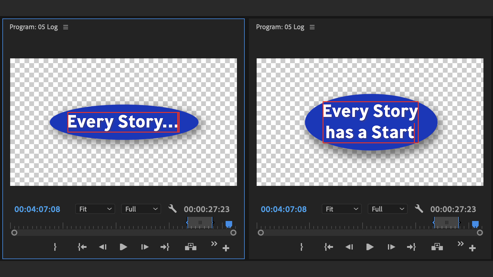
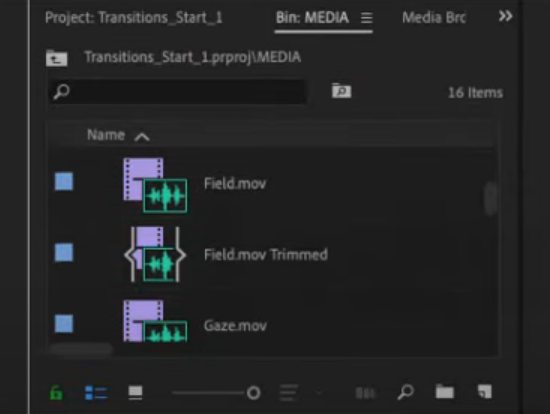
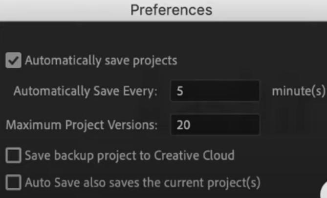
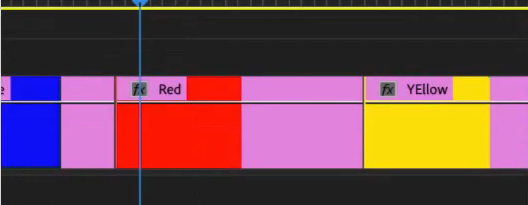
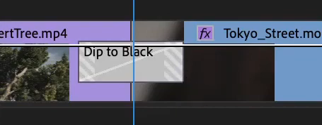
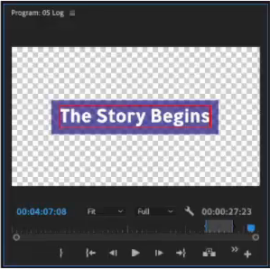
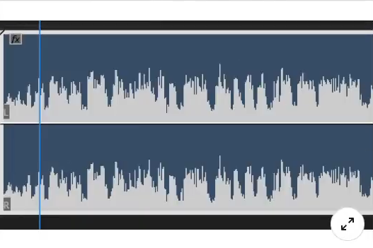

## Adobe Premiere Pro

#### Q1. Vous ouvrez une séquence imbriquée afin de réduire la longueur d’un élément. Vous allongez la durée totale des éléments. Qu’advient-il de la durée du nid dans la séquence principale?

*   \[x] Rien, la durée du nid reste la même dans la séquence d’origine.
*   \[ ] La durée de l’imbrication change et une modification d’écrasement pousse les éléments restants pour faire de la place.
*   \[ ] Les éléments changent de vitesse pour correspondre à la durée de l’imbrication.
*   \[ ] La durée de l’imbrication change et un montage d’ondulation pousse les éléments restants pour faire de la place.

#### Q2. Quelle est une bonne raison d’utiliser une séquence imbriquée ?

*   \[ ] L’imbrication améliore les performances de lecture.
*   \[ ] L’imbrication facilite la réduction de l’encombrement dans le panneau Projet, ce qui permet d’économiser du temps et potentiellement du budget du projet.
*   \[x] L’imbrication permet d’appliquer un seul effet à tout ce qui se trouve à l’intérieur du nid, comme une correction des couleurs ou un limiteur vidéo.
*   \[ ] L’imbrication permet à Adobe Premiere Pro d’effectuer un rendu plus rapide.

#### Q3. Que se passe-t-il sur votre disque dur lorsque vous créez un sous-élément ?

*   \[x] Rien, puisqu’un sous-clip ne crée pas de nouveau fichier multimédia sur votre disque dur.
*   \[ ] Un fichier de pointeur est créé sur votre disque dur.
*   \[ ] Un nouveau clip maître est créé sur votre disque dur et ajouté au projet.
*   \[ ] Un nouveau fichier multimédia est créé à côté du média d’origine.

#### Q4. Quelle déclaration est *faux* concernant l’exportation de médias à partir d’Adobe Premiere Pro ?

*   \[ ] Adobe Premiere peut exporter directement des fichiers.
*   \[ ] Vous pouvez encoder des séquences dans un ou plusieurs formats avec Adobe Media Encoder.
*   \[ ] Lorsque vous utilisez Adobe Media Encoder, vous pouvez continuer à travailler sur la même séquence dans Adobe Premiere Pro.
*   \[x] Lorsque vous cliquez sur Exporter, Adobe Premiere Pro encode le fichier en arrière-plan et vous permet de poursuivre le montage.

#### Q5. Lorsque vous travaillez dans Premiere Pro, comment créer rapidement une composition After Effects avec des paramètres correspondant à la séquence actuelle ?

*   \[ ] Sélectionnez Fichier > Adobe Dynamic Link > Importer une composition After Effects.
*   \[ ] Importez un projet à partir d’After Effects et choisissez Faire correspondre la taille du projet lors de l’importation.
*   \[x] Sélectionnez Fichier > Adobe Dynamic Link > Nouvelle composition After Effects.
*   \[ ] Passez à After Effects et configurez manuellement le projet pour plus de précision.

#### Q6. Quelle balise n’est PAS disponible dans le panneau Son essentiel ?

*   \[x] Narration
*   \[ ] SFX
*   \[ ] Ambiance
*   \[ ] Musique

#### Q7. La correction des couleurs secondaires HSL vous permet d’ajuster lequel des éléments suivants? (Sélectionnez trois éléments.)

```markdown
A. Clarity
B. Contrast
C. Saturation
D. Temperature
E. Blur
```

*   \[x] B, C, D
*   \[ ] A, B, C
*   \[ ] B, D, E
*   \[ ] A, C, E

#### Q8. Quel est le seul panneau dans lequel l’outil Étirement de la fréquence peut modifier un élément ?

*   \[ ] Panneau Moniteur du programme
*   \[ ] Panneau Moniteur source
*   \[x] Panneau Montage
*   \[ ] Panneau Navigateur multimédia

#### Q9. Que pouvez-vous faire pour que le calque de forme ajuste automatiquement la taille à mesure que le calque de texte change ?



*   \[x] Sélectionnez l’option Masque avec forme.
*   \[ ] Sélectionnez Responsive Design et épingler au calque de texte.
*   \[ ] Sélectionnez Responsive Design et épingler à l’image vidéo.
*   \[ ] Utilisez les contrôles Aligner et Transformer.

#### Q10. Dans quel panneau assemblez-vous des médias afin de créer une séquence ?

*   \[ ] Panneau Montage
*   \[ ] Panneau Navigateur multimédia
*   \[ ] Panneau capture
*   \[x] Panneau Moniteur source

#### Q11. Quel panneau vous permet de modifier les effets vidéo après qu’ils ont été appliqués à un clip ?

*   \[x] Panneau Effets
*   \[ ] Panneau Montage
*   \[ ] Panneau Moniteur source
*   \[ ] Panneau Options d’effet

#### Q12. Supposons que vos clips soient liés à des fichiers multimédias stockés à plusieurs emplacements. Vous souhaitez avoir les fichiers multimédias dans un emplacement unique dans leur format actuel. Quelle option choisir dans le Gestionnaire de projets ?

*   \[ ] Exclure les clips inutilisés
*   \[ ] Consolider et transcoder
*   \[x] Collecter des fichiers et les copier vers un nouvel emplacement
*   \[ ] Créer un nouveau projet découpé

#### Q13. Quelle est la transition vidéo par défaut dans Adobe Premiere Pro ?

*   \[ ] film se dissoudre
*   \[ ] dissolution de l’additif
*   \[x] dissolution croisée
*   \[ ] dissolution de l’impact

#### Q14. Quel terme décrit l’algorithme utilisé pour encoder et décoder un fichier vidéo ?

*   \[ ] conteneur
*   \[ ] format
*   \[ ] compresseur
*   \[x] codec

#### Q15. Vous souhaitez enregistrer une courte partie d’un clip plus long pour un accès facile. Comment pouvez-vous faire cela?



*   \[ ] dans l’Explorateur de médias, marquez les points d’entrée et de sortie sur un élément, puis importez.
*   \[ ] Marquez les points d’entrée et de sortie sur l’élément dans le Moniteur du programme et sélectionnez Sélectionner l’option Clip > Make Subclip.
*   \[ ] Marquez les points d’entrée et de sortie d’un élément dans le panneau Montage, puis faites-le glisser dans une corbeille.
*   \[x] Marquez les points d’entrée et de sortie sur l’élément dans le Moniteur source et sélectionnez Elément > Créer un sous-élément.

#### Q16. Quel réglage peut aider à rétablir les détails de bord dans les séquences vidéo ?

*   \[ ] Intensité
*   \[ ] Contraste
*   \[x] Aiguiser
*   \[ ] Clarté

#### Q17. Où pouvez-vous ajuster la durée d’une transition?

*   \[ ] Panneau Effets
*   \[ ] Panneau projet
*   \[x] Panneau Options d’effet
*   \[ ] Panneau Moniteur du programme

#### Q18. Vous travaillez avec un nouveau projet et vous éditez depuis deux heures. Quel est le nombre de projets de sauvegarde que vous vous attendez à trouver ?



*   \[ ] 2
*   \[ ] 12
*   \[x] 20
*   \[ ] 24

#### Q19. Quel panneau utiliseriez-vous pour parcourir et importer des ressources afin d’assurer une compatibilité maximale avec Premiere Pro ?

*   \[ ] Bibliothèque
*   \[ ] Effets
*   \[ ] Projet
*   \[x] Navigateur multimédia

Référence : https://helpx.adobe.com/in/premiere-pro/how-to/import-with-media-browser.html#:~:text=The%20Media%20Browser%20panel%20should,with%20fragmented%20media%20file%20types.\&text=To%20import%20selected%20clips%20into,on%20them%20and%20choose%20Import.

#### Q20. Une transition est définie sur aligné au centre. Quel serait le résultat d’un glissement avec l’outil sélectionné, vers la droite ?


*   \[x] La transition glisserait vers la droite.
*   \[ ] Vous n’étendriez que le côté droit de la transition.
*   \[ ] Vous devez effectuer un montage d’ondulation et prolonger la durée du premier clip.
*   \[ ] La transition se ferait sentir des deux côtés.

#### Q21. Quelle application ne prend PAS en charge Dynamic Link ?

*   \[ ] Adobe Photoshop
*   \[ ] Adobe Premiere Pro
*   \[x] Adobe Audition
*   \[ ] Adobe After Effects

#### Q22. Quel volet de préférences inclut la durée par défaut de la transition vidéo et la durée par défaut de la transition audio ?

*   \[ ] Médias
*   \[ ] Lecture
*   \[ ] Généralités
*   \[x] Chronologie

#### Q23. Si un effet a une étoile à côté de son icône, de quel type d’effet s’agit-il ?

*   \[ ] audio
*   \[ ] modèle
*   \[ ] transition
*   \[x] préréglage

#### Q24. Comment ce clip a-t-il été manipulé à l’aide d’un réglage Courbes ?


*   \[x] Hue contre Luma
*   \[ ] Saturation vs saturation
*   \[ ] Teinte vs saturation
*   \[ ] Luma vs Saturation

#### Q25. Où les données de transparence sont-elles stockées lors de la composition de supports ?

*   \[ ] Panneau Graphiques essentiels
*   \[x] Panneau Effets
*   \[ ] canal alpha
*   \[ ] modification de l’assemblage

#### Q26. Lorsqu’une partie de vos séquences est transparente, où sont stockées les informations de transparence dans le fichier ?

*   \[ ] moniteur source
*   \[x] canal alpha
*   \[ ] Effet d’opacité
*   \[ ] effet alpha

#### Q27. Quelle option vous permet de réutiliser des fichiers de rendu précédemment créés pour une exportation ?

*   \[x] Utiliser les aperçus
*   \[ ] Utiliser la fusion d’images
*   \[ ] Utilisez une qualité de rendu maximale
*   \[ ] Paramètres de séquence de correspondance

#### Q28. Dans le scénario illustré ci-dessous, vous souhaitez étendre la fin de l’élément rouge dans le montage et ne pas modifier la durée de l’élément adjacent. Quel est le choix de finition le plus approprié pour y parvenir?



*   \[ ] Couper
*   \[x] Découper
*   \[ ] Ripple Trim In
*   \[ ] Ripple Trim Out

#### Q29. Quels sont les formats pris en charge par Adobe Media Encoder ? (Sélectionnez trois éléments.)

```markdown
A. GIF
B. DCP
C. QuickTime
D. HEVC
E. FLV
```

*   \[ ] A, B, C
*   \[ ] A, C, E
*   \[x] B, C, D
*   \[ ] B, D, E

#### Q30. Quel format de fichier vidéo pouvez-vous exporter avec Adobe Media Encoder ? (Sélectionnez trois éléments.)

```markdown
A. AVCHD
B. HEVC
C. Animated GIF
D. MXF OP1a
E. M4A
```

*   \[ ] A, B, C
*   \[ ] A, C, E
*   \[ ] B, C, D
*   \[x] B, D, E

#### Q31. Si vous avez placé un effet accéléré par GPU sur un élément du montage et que vous ne l’avez pas rendu, quelle couleur apparaît en haut de votre montage ?

*   \[x] rouge
*   \[ ] bleu
*   \[ ] jaune
*   \[ ] vert

#### Q32. Quelle déclaration est vraie au sujet des préférences Apparence ?

*   \[ ] La luminosité par défaut est la position à mi-chemin entre plus sombre et plus clair.
*   \[ ] Vous pouvez définir la barre supérieure des fenêtres sur une couleur d’accent personnalisée.
*   \[ ] Vous pouvez régler l’intensité de l’indicateur de mise au point pour aider à identifier facilement quelle fenêtre est active.
*   \[x] Vous pouvez modifier la couleur de surbrillance.

#### Q33. Que pouvez-vous dire sur cette transition ?



*   \[ ] Premiere insérera du blanc pour remplir les poignées nécessaires.
*   \[ ] Premiere insérera du noir pour remplir les poignées nécessaires.
*   \[ ] Il n’y a pas assez de supports (poignées) pour couvrir la durée de la transition.
*   \[ ] La transition est automatiquement raccourcie pour n’utiliser que les supports disponibles et aucune transition n’est appliquée à la zone située sous les lignes diagonales.

#### Q34. Votre projet comporte plusieurs séquences qui ne sont plus nécessaires. Comment utiliseriez-vous le Gestionnaire de projet pour produire une nouvelle version du projet qui exclut les séquences indésirables ?

*   \[ ] Désélectionnez les séquences indésirables dans la zone Séquence.
*   \[ ] Sélectionnez Créer un nouveau projet découpé.
*   \[ ] Sélectionnez Consolider et transcoder.
*   \[x] Choisissez Collecter les fichiers et Copier vers un nouvel emplacement.

#### Q35. Vous souhaitez prendre un élément partiel utilisé dans votre montage et l’envoyer à After Effects pour un traitement supplémentaire à l’aide de Dynamic Link. Quelle méthode y parvient le mieux ?

*   \[ ] Sélectionnez l’élément dans le scénario et choisissez Fichier > Adobe Dynamic Link > Importer une composition After Effects.
*   \[ ] Sélectionnez l’élément dans le scénario et choisissez Fichier > Adobe Dynamic Link > Remplacer par Composition After Effects.
*   \[ ] Sélectionnez l’élément dans le scénario et choisissez Fichier > Adobe Dynamic Link > Nouvelle composition After Effects.
*   \[ ] Sélectionnez l’élément dans le montage et choisissez Modifier > Copier. Basculez vers After Effects et choisissez Modifier > Coller.

#### Q36. Vous voulez réduire la saturation dans les nuages indiqués ci-dessous. Quel réglage des courbes rend cela plus facile?


*   \[ ] Teinte vs saturation
*   \[ ] Courbes RVB
*   \[ ] Luma vs Saturation
*   \[ ] Hue contre Luma

#### Q37. Quel est le nouveau type de calque graphique ? (Sélectionnez trois éléments.)

```markdown
A. Logo
B. Text
C. Rectangle
D. Circle
E. Ellipse
```

*   \[ ] A, B, C
*   \[ ] A, C, E
*   \[ ] B, C, E
*   \[ ] B, D, E

#### Q38. Quelle option peut créer un champ de couleur qui ajuste automatiquement la taille lorsque vous ajoutez ou soustrayez d’un calque de texte ?



*   \[ ] Choisissez Remplir dans les contrôles Apparence.
*   \[ ] Choisissez Contour dans les contrôles Apparence.
*   \[ ] Choisissez Arrière-plan dans les contrôles Apparence.
*   \[ ] Choisissez Ombre dans les contrôles Apparence.

#### Q39. Si vous souhaitez éclaircir uniquement les zones les plus sombres d’une image, quel curseur devez-vous ajuster dans l’effet Lumetri ?

*   \[ ] Ombres
*   \[ ] Contraste
*   \[ ] Tons moyens
*   \[ ] Noirs

#### Q40. En regardant l’histogramme ci-dessous, quel curseur de réglage unique pourrait créer ce changement?


*   \[ ] Noirs
*   \[x] Contraste
*   \[ ] Blancs
*   \[ ] Exposition

#### Q41. Sous quel menu déroulant pouvez-vous supprimer des effets ?

*   \[ ] Séquence
*   \[ ] Fichier
*   \[ ] Modifier
*   \[ ] Clip

#### Q42. Quel réglage pouvez-vous utiliser pour convertir rapidement des séquences de journal à l’aide des paramètres recommandés par un fabricant d’appareil photo ?

*   \[ ] Look créatif
*   \[ ] Film délavé
*   \[ ] Entrée LUT
*   \[ ] Intensité

#### Q43. Quel mode d’automatisation audio Mixer permet à une automatisation de revenir à l’état précédent après des ajustements ?

*   \[ ] Toucher
*   \[ ] Loquet
*   \[ ] Écrire
*   \[ ] Lire

#### Q44. Vous souhaitez que Premiere Pro crée une deuxième instance de vos fichiers multimédias et ajoute une version supplémentaire à un brouillon de résolution. Quelle option fonctionne le mieux dans les paramètres d’ingestion ?

*   \[ ] Transcoder
*   \[ ] Copier et créer des proxys
*   \[ ] Créer des proxys
*   \[ ] Copier

#### Q45. Si vous avez importé plusieurs séquences time-lapse dans votre projet en tant que séquences d’images, quelle option du Gestionnaire de projets est la plus utile pour archiver le projet ?

*   \[ ] Convertir des séquences d’images en clips
*   \[ ] Convertir des compositions After Effects en éléments
*   \[ ] Inclure des fichiers d’aperçu
*   \[ ] Consolider et transcoder

#### Q46. Quelle option est activée pour affecter la vue des formes d’onde audio comme indiqué ci-dessous ?



*   \[ ] Afficher les unités de temps audio
*   \[ ] Forme d’onde audio rectifiée
*   \[ ] Grandes formes d’onde audio
*   \[ ] Mise à l’échelle logarithmique des images clés

#### Q47. Vous souhaitez faire flotter le panneau Historique indépendamment pour le positionner sur un autre moniteur en tant que fenêtre flottante. Quelle option dans le sous-menu du panneau devez-vous sélectionner ?

*   \[ ] Panneau De désanfinage
*   \[ ] Cadre de désanfinage
*   \[ ] Panneau Agrandir
*   \[ ] Agrandir le cadre

#### Q48. Pour organiser rapidement les panneaux dans Adobe Premiere Pro pour une tâche spécifique, qu’utilisez-vous ?

*   \[x] espaces de travail
*   \[ ] mises en page
*   \[ ] préréglages du panneau
*   \[ ] événements
