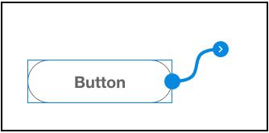

## Adobe XD

#### P1. ¿Dónde estaba esto? `Lock` icono aplicado?

*   \[ ] en el `Components` tablero
*   \[x] en el `Layers` tablero
*   \[ ] en el `Property Inspector`
*   \[ ] en modo Compartir

#### P2. En esta figura, ¿qué valor representa el margen inferior de la cuadrícula de diseño?

*   \[ ] 30
*   \[x] 20
*   \[ ] 43
*   \[ ] 0

#### P3. ¿Qué le permite hacer clic en el icono con círculos?

*   \[ ] Cambie el disparador.
*   \[ ] Elija un destino.
*   \[ ] Añadir una nueva interacción.
*   \[x] Agregue un nuevo estado.

#### P4. Quieres compartir tu proyecto en un blog o redes sociales. ¿Cómo lograrías esto?

*   \[x] Enlace al proyecto desde su cuenta de Creative Cloud.
*   \[ ] Utilice el enlace prototipo.
*   \[ ] Añadir el enlace prototipo a un blog.
*   \[ ] Añade tus cuentas de redes sociales a tu lista de invitaciones.

#### P5. Debe tener un teclado que aparezca cuando se toca un área de texto. ¿Qué tipo de acción debe aplicar?

*   \[ ] Animación automática
*   \[ ] Superposición
*   \[ ] Mesa de trabajo anterior.
*   \[ ] Transición.

#### P6. ¿Cómo se evita que las guías se ajusten a los objetos de la mesa de trabajo?

*   \[ ] Pulse Opción (Mac) o Alt (Windows) al arrastrar la guía.
*   \[х] Pulse Comando (Mac) o Ctrl (Windows) al arrastrar la guía.
*   \[ ] Pulse la tecla Mayús al arrastrar la guía.
*   \[ ] Arrastre la guía a su ubicación en la mesa de trabajo.

#### P7. Su desarrollador le notifica que la alineación izquierda de parte del texto en una diapositiva en el menú está desactivada en 2 píxeles. ¿Cómo captó esto el desarrollador?

*   \[ ] Los valores de distancia se muestran en la pantalla de uso compartido del desarrollador.
*   \[ ] El desarrollador los volcó en la pantalla de compartir del desarrollador.
*   \[ ] Los diferentes valores se observaron en el CSS.
*   \[ ] Las guías de la mesa de trabajo aparecen en la pantalla de uso compartido del desarrollador.

#### P8. ¿Cómo se puede cambiar un componente por otro que ya está en el proyecto?

*   \[ ] Copie el componente en el panel Activos, seleccione el componente en el proyecto y péguelo.
*   \[ ] Elimine el componente del proyecto y arrastre el nuevo componente desde el panel Activos
*   \[ ] Haga clic con el botón secundario en el componente que desea reemplazar y seleccione Editar maestro en el documento de origen.
*   \[ ] Arrastre el nuevo componente desde el panel Activos sobre el componente existente en el proyecto.

#### P9. Ha creado un botón y lo ha convertido en un componente para que el botón sea interactivo. Cuando abre el área Componente (maestro) en el Inspector de propiedades y hace clic en Estado predeterminado, observa que el botón ya tiene un estado aplicado. ¿Qué estado se aplica?

*   \[x] Desplazarse
*   \[ ] Arrastrar
*   \[ ] Voz
*   \[ ] Toca

#### P10. Ha copiado una interacción en el portapapeles. ¿Cómo aplicarías esta interacción a múltiples objetos?

*   \[ ] Pulse Mayús y haga clic en cada objeto y pegue la interacción.
*   \[ ] Seleccione las mesas de trabajo y pegue la interacción.
*   \[ ] Seleccione cada objeto y pegue la interacción.
*   \[ ] Marque los objetos y pegue la interacción.

#### P11. La vista previa del dispositivo requiere un \_

*   \[ ] dispositivo móvil con NFC
*   \[ ] conexión bluetooth
*   \[ ] Conexión USB
*   \[ ] conexión inalámbrica

#### P12. ¿Qué configuración de exportación usaría para crear un activo de baja resolución cuyo tamaño es el 50% del activo en la pantalla?

*   \[ ] Diseñado a 3X
*   \[ ] Diseñado para Web
*   \[ ] Diseñado a 1X
*   \[ ] Diseñado a 2X

#### P13. ¿Qué indica este cable conectado a un componente?

*   \[ ] destino.
*   \[x] interacción.
*   \[ ] disparador
*   \[ ] animación.

#### P14. ¿Qué sucede cuando hace clic en este icono con círculos en la vista previa del diseño?

*   \[x] La vista previa cambia a la vista de mesa de trabajo.
*   \[ ] La vista previa cambia al flujo de usuario.
*   \[ ] La vista previa cambia a la vista de desarrollador.
*   \[ ] Se muestran las propiedades de la mesa de trabajo

#### P15. ¿Qué método para llevar el contenido de Illustrator a XD no es posible?

*   \[ ] Arrastre un archivo de Illustrator (. Al) en un proyecto XD.
*   \[x] Copie y pegue contenido de Illustrator a XD.
*   \[ ] Abrir un archivo de Illustrator (. Al) en XD para convertirlo en un proyecto XD.
*   \[ ] Importar un archivo de Illustrator (. Al) en un proyecto XD.

#### P16. Después de completar un proyecto, desactivó un par de fuentes de Adobe. Ahora necesita realizar cambios en el archivo XD. ¿Cómo se vuelven a habilitar las fuentes de Adobe en XD?

*   \[ ] Abra las fuentes de Creative Cloud y haga clic en Habilitar.
*   \[ ] Habilite las fuentes en la configuración de fuentes de su computadora.
*   \[ ] Las fuentes de Adobe se reactivan automáticamente a través de Creative Cloud.
*   \[ ] Vuelva a vincular las fuentes a su biblioteca de Creative Cloud.
