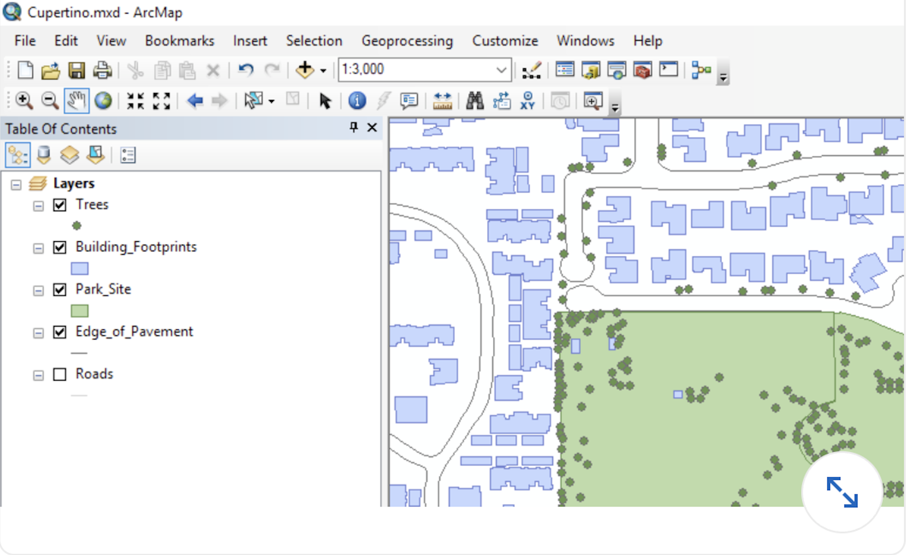
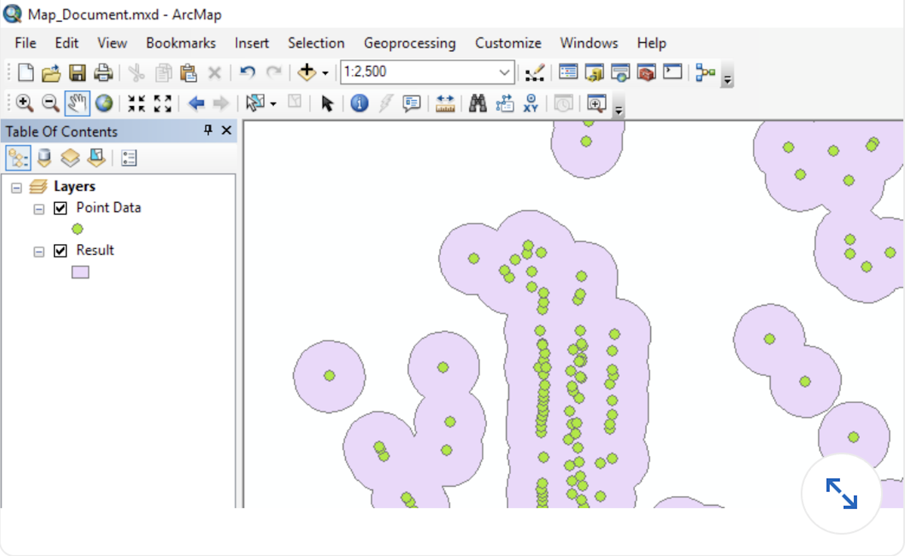

## Arc GIS

#### Q1. Which is the most effective way to have labels for different street types be shown at different scale ranges?

- [ ] Use the **Draw** toolbar to create text boxes for each street type
- [ ] Create label classes for each type of street
- [x] Create a separate layer for each street type
- [ ] This is not possible. Labels are the same at all scale ranges

#### Q2. In ArcGIS Pro, what are the two viewing modes for scenes?

- [ ] 2D and 3D
- [x] Global and Local
- [ ] Small scale and Large scale
- [ ] Solid and Wireframe

[Reference](https://doc.arcgis.com/en/arcgis-online/create-maps/choose-global-local-scene.htm)

#### Q3. When an ArcMap .mxd file is imported into ArcGIS Pro, what is each data frame in the original document converted to in the ArcGIS Pro project?

- [ ] basemap
- [ ] layout
- [ ] local scene
- [x] map

[Reference](https://pro.arcgis.com/en/pro-app/latest/get-started/migrate-content-to-arcgis-pro.htm#:~:text=Each%20data%20frame%20in%20an%20ArcMap%20document%20becomes%20a%20separate%20map%20in%20ArcGIS%20Pro.)

#### Q4. Which is a collection of raster datasets stored as a catalog that allows you to view or access the datasets as a single merged image or individual images?

- [ ] an image collection dataset
- [x] a mosaic dataset
- [ ] raster tiles
- [ ] a folder of raster data files

[Reference](https://desktop.arcgis.com/en/arcmap/10.7/manage-data/raster-and-images/how-raster-data-is-stored-and-managed.htm#:~:text=A%20mosaic%20dataset%20is%20a,size%20and%20number%20of%20datasets.)

#### Q5. Using the explore tool in ArcGIS Pro, how do you zoom in and out of the map?

- [ ] Press shift and left-click to zoom in. Press ctrl and left-click to zoom out.
- [ ] Hold the left mouse button, and drag up to zoom in and drag down to zoom out.
- [x] Move the mouse scroll wheel forward to zoom out and backward to zoom in.
- [ ] Click and drag a box with the left mouse button to zoom in; press shift and drag a box to zoom out.

[Reference](https://pro.arcgis.com/en/pro-app/latest/help/mapping/navigation/navigation-in-arcgis-pro.htm#:~:text=Explore%20maps%20and%20scenes,-The%20default%20tool&text=%2C%20which%20is%20used%20to%20move,up%20or%20down%20to%20zoom.)

#### Q6. Which Layer in this map is currently not visible in the data frame?

- [ ] Trees
- [ ] Building_Footprints
- [ ] Sewer_Lines
- [x] Roads

#### Q7. When you zoom in on a map, how are you changing the view

- [ ] from a higher scale to a lower scale
- [ ] from a smaller scale to a larger scale
- [ ] from a lower scale to a higher scale
- [ ] from a larger scale to a smaller scale

#### Q8. Where are parcel fabrics, geometric networks, and topologies created?

- [ ] inside of file geodatabases
- [ ] inside of enterprise geodatabases
- [ ] inside of feature datasets
- [ ] inside of feature classes

#### Q9. Which of these methods is best for sharing a map with colleagues who do not have ArcMap or ArcGis Pro?

- [ ] Export the map to PDF and send your colleagues the PDF.
- [ ] Export the map to KML and ask your colleagues to download Google Earth.
- [ ] Publish the map as a service and then create a web map that you can share with your colleagues
- [ ] Export the map to a map package, and ask your colleagues to download and install the free Map Package Viewer software

#### Q10. You built a model and verified that it works as intended by running it on your own data files. What is the best way to share the entire procedure with colleagues so that they can study it, reproduce your results exactly, and then apply the model to their own data?

- [ ] Convert the model to Python and upload the results to ArcGIS Online as a service.
- [ ] Create a geoprocessing package.
- [ ] Run the consolidated Model tool to gather the model and input datasets into a shared folder
- [ ] Create a map Package

#### Q11. Which is an example of geographic coordinate system?

- [x] WGS 1984
- [ ] Winkel Tripel
- [ ] Universal Transverse Mercator
- [ ] Natural Earth

#### Q12. When you create a bookmark of your current map view, what is being saved?

- [ ] the map's current scale and center point
- [ ] the visibility status of each layer
- [ ] the center point of the current view
- [ ] the map's current scale

#### Q13. What geoprocessing tool, when applied to the Point Data Layer, is most likely responsible for the data shown in the Result Layer?

- [ ] Dissolve
- [ ] Buffer
- [ ] Merge
- [ ] Intersect

#### Q14. By default, as what do all geoprocessing tools run from dialog boxes execute?

- [ ] Python Scripts
- [ ] foreground processes
- [ ] background processes
- [ ] in-memory processes

#### Q15. A grayscale raster is said to have a single \***\*\_\*\*** while a full-color RGB raster has three \***\*\_\*\***.

- [ ] band; bands
- [ ] color; colors
- [ ] channel; channels
- [ ] value; values
