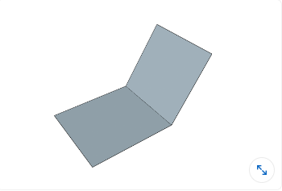
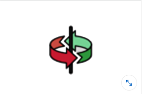
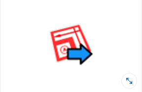
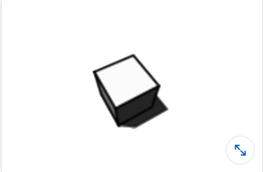

## Sketchup

#### Q1. Which of these will NOT stretch geometry if you click it with the Move tool and move your cursor outward?

- [x] a group
- [ ] and edge
- [ ] an endpoint
- [ ] a face

#### Q2. What is needed to use the Follow Me tool?

- [x] a continuous path of edges
- [ ] a correctly oriented face
- [ ] the Push/Pull tool
- [ ] the Offset and Move tools

#### Q3. What does dragging a selection windows arround entities from left to right do?

- [ ] It deselect any preselect items.
- [ ] It causes selected entities to turn from blue to yellow.
- [x] It selects entities that are entirely contained in the selection box.
- [ ] It selects anything the selection touch box.

#### Q4. What do layers control?

- [x] Visibility
- [ ] Grouping
- [ ] Stacking groups
- [ ] Separating entities.

#### Q5. What action is demonstrated in this image?

- [x] inference
- [ ] push
- [ ] pull
- [ ] offset

#### 6. Which action keeps two edges from "Stacking" together?

- [x] grouping
- [ ] intersection
- [ ] avoiding edges touch
- [ ] drawing perpendicular

#### Q7. In LayOut, how can you set the default lenght of dimension leader lines?

- [ ] &shy;
- [ ] &shy;
- [ ] &shy;
- [x] 1.Create a dimension and click and drag each leader line to your desire length with the select-tool. 2. Right-click the leader line and select Copy. 3. Continue to draw subsequence dimension with the new leader line length applied.

#### Q8. Which tool allows you to scale an edge to a new size that you specify by the typing in the desired measurement?

- [ ] Right-Click
- [ ] Protractor
- [ ] Type measurement
- [x] Scale

#### Q9. How do you round off and trim a corner with only a 2 Point arc tool?

- [x] 2.Double click and adjacent edge where it says tangent to edge while inference color is magenta.
- [ ] 2.Right click and select trim.
- [ ] you cannot do this only with 2 point arc tool
- [ ] &shy;

#### Q10. What is the best way to click in the measurement box?

- [x] to start a new measurement
- [ ] when you would like to edit a measurement
- [ ] there is never
- [ ] to delete a measurement

#### Q11. You have created a 3D model and are concerned that some of the edges that are intended to be aligned with the axis and not. How can you check this?

- [x] Click Camera > Standar View > By Axis
- [ ] &shy;
- [ ] &shy;
- [ ] &shy;

#### Q12. The drawing on the left has hidden line style...

- [ ] &shy;
- [ ] &shy;
- [ ] &shy;
- [x] In the Style Window, select the edit tab, click The Edges icon and select the back edge option.

#### Q13. Which arrow key allows you to toggle between parallel and perpendicular (magenta) inference direction?

- [ ] Left
- [x] Down Arrow
- [ ] Right
- [ ] Up

#### Q14. How can you check the lenght of an edge?

- [ ] Use the selct tool
- [ ] Righr click on an edge
- [ ] Use the tape measurement tool to click...
- [x] Use the tape measurement tool to hover over...

#### Q15. Where can you quickly find helpful hints and trick while using tools?

- [ ] measurement box
- [ ] ywllow dialog box
- [x] help menu
- [ ] status bar

#### Q16. The image below shows The label and auto

- [x] 1.2.3.4.5
- [ ] 1.2.
- [ ] 1.2
- [ ] 1.2.3

#### Q17. Which method creates a perpendicular view of a selection cut?

- [ ] Orbit
- [ ] Righ-Click
- [ ] Righ-Click
- [x] Click view > Selection Plane Direct

#### Q18. What is SketchUp primarily used for?

- [ ] 2D drawing
- [x] 3D modeling
- [ ] Photo editing
- [ ] Word processing

#### Q19. Which of the following tools in SketchUp allows you to create a straight line segment between two points?

- [ ] Push/Pull
- [ ] Eraser
- [x] Line
- [ ] Move

#### Q20. In SketchUp, what is the keyboard shortcut to orbit the camera view?

- [x] O
- [ ] R
- [ ] V
- [ ] P

#### Q21. What is the purpose of the "Follow Me" tool in SketchUp?

- [ ] To move objects along a path
- [ ] To create a path for animations
- [x] To extrude a 2D shape along a 3D path
- [ ] To generate text labels

#### Q22. Which of the following file formats is commonly used for importing and exporting 3D models in SketchUp?

- [ ] .JPG
- [ ] .PDF
- [x] .SKP
- [ ] .TXT

#### Q23. What is the name of the 3D warehouse where SketchUp users can find and share 3D models?

- [ ] 3D Central
- [ ] 3D Depot
- [x] 3D Warehouse
- [ ] 3D Exchange

#### Q24. Which toolbar in SketchUp contains tools for drawing shapes like rectangles, circles, and polygons?

- [ ] File
- [ ] Edit
- [x] Draw
- [ ] View

#### Q25. What does the "Component" feature in SketchUp allow you to do?

- [x] Group objects together for easy editing and duplication
- [ ] Change the background color of your model
- [ ] Render 3D models into 2D images
- [ ] Import 2D images into your model

#### Q26. Which axis represents the blue color in the SketchUp interface?

- [ ] Red
- [ ] Green
- [x] Blue
- [ ] Yellow

#### Q27. What tool in SketchUp is used to create a 3D model from a 2D shape by pushing or pulling it into 3D space?

- [x] Extrude
- [ ] Revolve
- [ ] Loft
- [ ] Selection Plane

#### Q28. What is SketchUp primarily used for?

- [ ] 2D drafting
- [x] 3D modeling
- [ ] Video editing
- [ ] Spreadsheet calculations

#### Q29. Which tool in SketchUp is used to create straight lines?

- [ ] Eraser tool
- [x] Line tool
- [ ] Arc tool
- [ ] Rotate tool

#### Q30. How can you navigate in the 3D environment of SketchUp?

- [ ] Use the keyboard arrow keys
- [ ] Use the Paint tool
- [x] Use the Scroll Wheel and Pan tool
- [ ] Use the Text tool

#### Q31. To create a 3D object in SketchUp, you typically start with which tool?

- [ ] Move tool
- [ ] Zoom tool
- [x] Rectangle tool
- [ ] Tape measure tool

#### Q32. What does the Push/Pull tool do in SketchUp?

- [ ] Measures distances
- [x] Expands 2D shapes into 3D objects
- [ ] Creates text notes
- [ ] Adds color to surfaces

#### Q33. How do you prevent objects from automatically fusing together in SketchUp?

- [ ] You can't prevent it
- [ ] Use the Rotate tool
- [x] Group the objects
- [ ] Use the Paint tool

#### Q34. Which extension is required to export a SketchUp model as an STL file?

- [ ] It's built-in and doesn't require an extension
- [ ] SketchUp OBJ
- [ ] SketchUp 3DS
- [x] SketchUp STL

#### Q35. How do you save your work in SketchUp?

- [x] Click File > Save
- [ ] Use the Export tool
- [ ] Press Ctrl+S (or Command+S on Mac)
- [ ] It's automatically saved

#### Q36. How do you add to a selection?

- [ ] Activate the Select tool, hold down the Tab key, and click each entity that you would like to add to the selection set.
- [ ] Hold down the A key, activate the Select tool, and click each entity that you would like to add to the selection set.
- [x] Activate the Select tool, hold down the Shift key, and click each entity you would like to add to the selection set.
- [ ] Activate the Select tool, press the Plus Sign (+), and click each entity that you would like to add to the selection set.

#### Q37. what is the purpose of the 2D people included in some sketchUp templates?

- [ ] to create a point of inference
- [x] to show a scale reference
- [ ] to introduce you to SketchUp staff
- [ ] to practice using the Select and Eraser tools

#### Q38. How would you move a group from an existing layer called walls to an existing layer called Ceiling?

- [x] Right-click the group and select Entity info, and then use the drop-down menu and select ceiling.
- [ ] Right-click the group and select Make Component.Then, in the component dialog box, select the Ceiling layer.
- [ ] Right-click the group and select Layers, and then use the drop-down menu and select ceiling.
- [ ] Right-click the group and select edit Group > Layers, and then use the drop-down menu and select ceiling.

#### Q39. which method creates a perpendicular view of a section cut?

- [x] Right-click the section plane and select Align View.
- [ ] click view > Section Plane Direct.
- [ ] orbit and pan through your model until you see the correct view.
- [ ] Right-click the section plane and select orbit to Direct View.

#### Q40. How many edges are in this image?

- [x] seven
- [ ] eight
- [ ] three
- [ ] four

#### Q41. What action is being demonstrated in this image?

- [ ] Offset
- [ ] Rise
- [x] Inference
- [ ] Pull

#### Q42. what is the Hybrid rendering option for in Layout?

- [ ] This option is used when there is more than one scale among multiple viewports on a page.
- [x] It combines scalable vector linework with raster rendering for materials.
- [ ] It combines scalable vector linework with faster rendering speed.
- [ ] There are not any rendering options in Layout.

#### Q43. When some faces are oriented correctly and others are not, what is considered the most efficient way to correctly orient all faces?
- [ ] Select all geometry and choose orient Faces.
- [ ] Hold the Shift key and select all backward faces, right-click the selection, and select Reverse Faces.
- [x] Right-click a correctly oriented face and select orient Faces.
- [ ] Right-click each backward face and select Reverse Face.

#### Q44. How do you sample a material that has been used in the model?

- [ ] In the Tools drop-down menu, select Material, right-click the material, and select Texture > Sample.
- [ ] Activate the Paint Bucket tool, right-click the material, and select Texture > Sample.
- [ ] Open the Materials window. Under the Colors In Model file, scroll down until you find the reference material, and then click the thumbnail.
- [x] Activate the Paint Bucket tool, hold down Ctrl (Command), and then click the material that has already been applied to a face in the model.

#### Q45. The cube on the bottom is in one group and the cube on top is in another group.How can you keep them in two separate groups,but have them appear as one when not selected?

- [ ] Erase the bottom edges in the top group and the top edges in the bottom group.
- [ ] Extrude both farther so that the geometry is overlapping.
- [ ] offset the bottom of the top group and the top of the bottom group.
- [x] Hide the bottom edges in the top group and the top edges in the bottom group.

#### Q46. How can you create a component that will always face your view?

- [ ] Right-click the component after creating it and select Always face camera from the menu.
- [x] when creating the component, select Face Me in the dialog box.
- [ ] Right-click the component after creating it and select Face Me from the menu.
- [ ] when creating the component, select Always face camera in the dialog box.

#### Q47. which icon represents a tool that will extrude a surface?

- [ ]
- [x]
- [ ]
- [ ]
